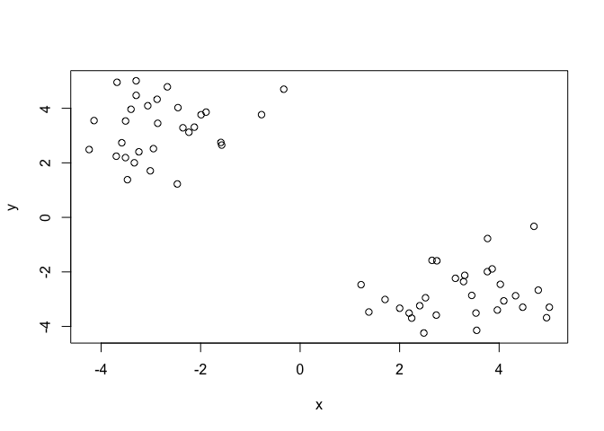
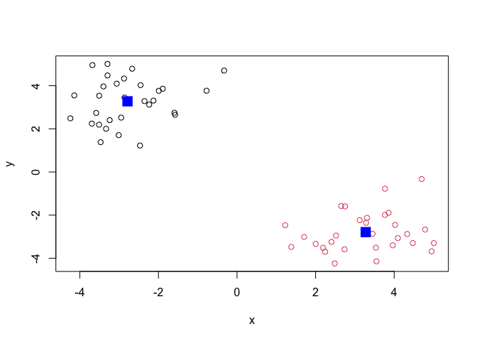
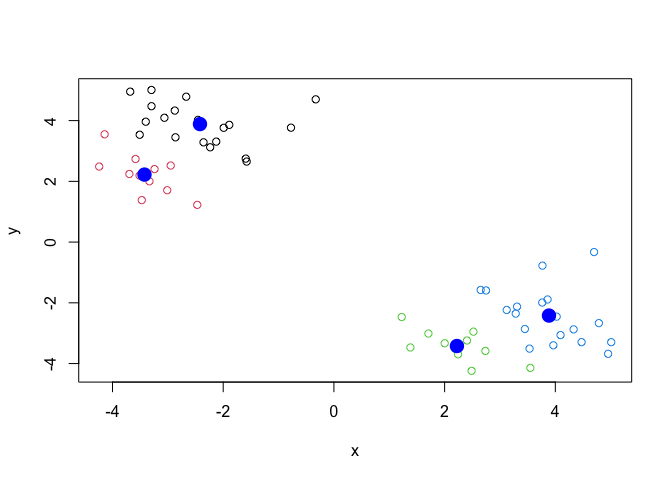
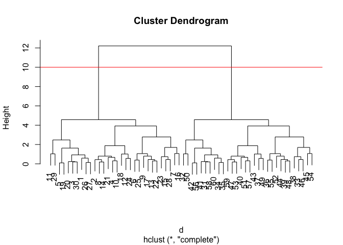
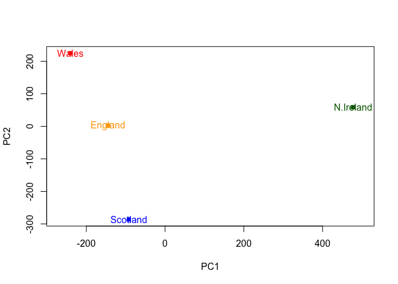

Class 7: Machine Learning I
================
Cynthia Lin

## K-means

Make up some input data where we know what the answer should be

``` r
tmp <- c( rnorm(30, -3), rnorm(30, +3) )
x <- cbind( x= tmp, y= rev(tmp))
head(x)
```

                 x        y
    [1,] -2.455340 4.024024
    [2,] -3.332424 2.001327
    [3,] -2.235356 3.121543
    [4,] -2.948509 2.520247
    [5,] -1.592492 2.748041
    [6,] -3.680104 4.953457

Quick plot of x to see the two groups at -3,+3 and +3,-3

``` r
 plot(x)
```



Use the `kmeans()` function setting k to 2 and nstart=20

``` r
km <- kmeans(x, centers = 2, nstart=20)
km
```

    K-means clustering with 2 clusters of sizes 30, 30

    Cluster means:
              x         y
    1 -2.787244  3.275755
    2  3.275755 -2.787244

    Clustering vector:
     [1] 1 1 1 1 1 1 1 1 1 1 1 1 1 1 1 1 1 1 1 1 1 1 1 1 1 1 1 1 1 1 2 2 2 2 2 2 2 2
    [39] 2 2 2 2 2 2 2 2 2 2 2 2 2 2 2 2 2 2 2 2 2 2

    Within cluster sum of squares by cluster:
    [1] 57.28333 57.28333
     (between_SS / total_SS =  90.6 %)

    Available components:

    [1] "cluster"      "centers"      "totss"        "withinss"     "tot.withinss"
    [6] "betweenss"    "size"         "iter"         "ifault"      

> Q. What component if your result object details -cluster assignment /
> membership? cluster center?

``` r
km$cluster
```

     [1] 1 1 1 1 1 1 1 1 1 1 1 1 1 1 1 1 1 1 1 1 1 1 1 1 1 1 1 1 1 1 2 2 2 2 2 2 2 2
    [39] 2 2 2 2 2 2 2 2 2 2 2 2 2 2 2 2 2 2 2 2 2 2

``` r
km$centers
```

              x         y
    1 -2.787244  3.275755
    2  3.275755 -2.787244

> Q. Plot x colored y the kmeans cluster assignment and add cluster
> centers as blue points.

``` r
plot( x, col= km$cluster)
points(km$centers, col = "blue", pch=15, cex = 2)
```



PLay with kmeans and ask for different number of clusters

``` r
km <- kmeans(x, centers = 4, nstart = 20)
plot(x, col= km$cluster)
points(km$centers, col = "blue", pch = 16, cex =2)
```



# Hierarchical Clustering

This is another very useful and widely employed clustering method which
has the advnatage over kmeans in that it can help reveal the somethign
of the true grouping in your data.

The `hclust()` function wants a distance matrix as input. We can get
this from the `dist()` function.

``` r
d <- dist(x)
hc <- hclust(d)
hc
```


    Call:
    hclust(d = d)

    Cluster method   : complete 
    Distance         : euclidean 
    Number of objects: 60 

There is a plot method for hclust results:

``` r
plot(hc)
abline(h=10, col = "red")
```



To get my cluster membership vector I need to “cut” my tree to yield
sub-trees or branches with all the members of a given cluster residing
on the same cut branch. The function to do this is called `cutree()`

``` r
grps <- cutree(hc, h=10)
grps
```

     [1] 1 1 1 1 1 1 1 1 1 1 1 1 1 1 1 1 1 1 1 1 1 1 1 1 1 1 1 1 1 1 2 2 2 2 2 2 2 2
    [39] 2 2 2 2 2 2 2 2 2 2 2 2 2 2 2 2 2 2 2 2 2 2

It is often helpful to use the `k=` argument to cutree rather than the
`h=` height of cutting with ’cutree()\`. This will cut the tree to yield
the number of clusters you want.

``` r
cutree(hc, k =4)
```

     [1] 1 2 1 2 1 2 2 2 2 2 1 2 2 2 2 2 2 2 1 1 2 2 2 2 2 1 1 2 1 1 3 3 4 3 3 4 4 4
    [39] 4 4 3 3 4 4 4 4 4 4 4 3 4 4 4 4 4 3 4 3 4 3

# Principal Component Analysis (PCA)

The base R function for PCA is called `prcomp()` Lets play with some 17D
data (very small data set) and see how PCA can help.

## PCA of UK food data

Import the data

``` r
url <- "https://tinyurl.com/UK-foods"
x <- read.csv(url)
head(x)
```

                   X England Wales Scotland N.Ireland
    1         Cheese     105   103      103        66
    2  Carcass_meat      245   227      242       267
    3    Other_meat      685   803      750       586
    4           Fish     147   160      122        93
    5 Fats_and_oils      193   235      184       209
    6         Sugars     156   175      147       139

**Q1. How many rows and columns are in your new data frame named x? What
R functions could you use to answer this questions?**

``` r
dim(x)
```

    [1] 17  5

Preview the first 6 rows

``` r
head(x)
```

                   X England Wales Scotland N.Ireland
    1         Cheese     105   103      103        66
    2  Carcass_meat      245   227      242       267
    3    Other_meat      685   803      750       586
    4           Fish     147   160      122        93
    5 Fats_and_oils      193   235      184       209
    6         Sugars     156   175      147       139

# Note how the minus indexing works

``` r
rownames(x) <- x[,1]
x <- x[,-1]
head(x)
```

                   England Wales Scotland N.Ireland
    Cheese             105   103      103        66
    Carcass_meat       245   227      242       267
    Other_meat         685   803      750       586
    Fish               147   160      122        93
    Fats_and_oils      193   235      184       209
    Sugars             156   175      147       139

``` r
dim(x)
```

    [1] 17  4

``` r
x <- read.csv(url, row.names=1)
head(x)
```

                   England Wales Scotland N.Ireland
    Cheese             105   103      103        66
    Carcass_meat       245   227      242       267
    Other_meat         685   803      750       586
    Fish               147   160      122        93
    Fats_and_oils      193   235      184       209
    Sugars             156   175      147       139

**Q2. Which approach to solving the ‘row-names problem’ mentioned above
do you prefer and why? Is one approach more robust than another under
certain circumstances?**

I prefer the second approach better because it is more condensed and
shorter. Furthermore, the first approach code block starts deleting
columns once you run it multiple times. Therefore the second approach
code is more robust and sustainable.

Spotting major differences and trends

``` r
barplot(as.matrix(x), beside=F, col=rainbow(nrow(x)))
```


**Q3: Changing what optional argument in the above barplot() function
results in the following plot?** Changing the `beside=T` to
`beside =False` has made the bar plots wider and combined instead of
displayed as a distribution. Leaving this argument out has the same
effect as it being false because each bar of the plot will correspond to
being stacked.

**Q5: Generating all pairwise plots may help somewhat. Can you make
sense of the following code and resulting figure? What does it mean if a
given point lies on the diagonal for a given plot?**

``` r
pairs(x, col=rainbow(10), pch=16)
```


I think that it is difficult ot make sense of this data. If a given
point is on the diagonal for a given plot, I think that it means that it
follows the line of best fit and follows the trends of the data. I think
that it also shows the density and level of correlation between the
variables.

**Q6. What is the main differences between N. Ireland and the other
countries of the UK in terms of this data-set?** The main differences
between N. Ireland and the other countries of the UK in terms of this
data set would be that N. Ireland eats the most carcass meat and least
amount of fish.

``` r
pca <- prcomp( t(x))
summary(pca)
```

    Importance of components:
                                PC1      PC2      PC3       PC4
    Standard deviation     324.1502 212.7478 73.87622 4.189e-14
    Proportion of Variance   0.6744   0.2905  0.03503 0.000e+00
    Cumulative Proportion    0.6744   0.9650  1.00000 1.000e+00

a “PCA plot” (a.k.a. “Score Plot”, PC1vsPC2 plot, etc.)

``` r
pca$x
```

                     PC1         PC2         PC3           PC4
    England   -144.99315    2.532999 -105.768945  2.842865e-14
    Wales     -240.52915  224.646925   56.475555  7.804382e-13
    Scotland   -91.86934 -286.081786   44.415495 -9.614462e-13
    N.Ireland  477.39164   58.901862    4.877895  1.448078e-13

``` r
# Use the prcomp() PCA function 
pca <- prcomp( t(x) )
summary(pca)
```

    Importance of components:
                                PC1      PC2      PC3       PC4
    Standard deviation     324.1502 212.7478 73.87622 4.189e-14
    Proportion of Variance   0.6744   0.2905  0.03503 0.000e+00
    Cumulative Proportion    0.6744   0.9650  1.00000 1.000e+00

**Q7. Complete the code below to generate a plot of PC1 vs PC2. The
second line adds text labels over the data points.** \# Plot PC1 vs PC2

``` r
plot(pca$x[,1], pca$x[,2], xlab="PC1", ylab="PC2", xlim=c(-270,500))
text(pca$x[,1], pca$x[,2], colnames(x))
```


**Q8. Customize your plot so that the colors of the country names match
the colors in our UK and Ireland map and table at start of this
document.**

``` r
plot(pca$x[,1], pca$x[,2], xlab="PC1", ylab="PC2", xlim=c(-270,500), 
     col=c("orange", "red","blue", "darkgreen"), pch=15)
text(pca$x[,1], pca$x[,2], 
     colnames(x), col=c("orange", "red", "blue", "darkgreen"), 
     pch=15)
```



``` r
v <- round( pca$sdev^2/sum(pca$sdev^2) * 100 )
v
```

    [1] 67 29  4  0

``` r
## or the second row here...
z <- summary(pca)
z$importance
```

                                 PC1       PC2      PC3          PC4
    Standard deviation     324.15019 212.74780 73.87622 4.188568e-14
    Proportion of Variance   0.67444   0.29052  0.03503 0.000000e+00
    Cumulative Proportion    0.67444   0.96497  1.00000 1.000000e+00

``` r
barplot(v, xlab="Principal Component", ylab="Percent Variation")
```


\##Digging deeper (variable loadings)

``` r
## Lets focus on PC1 as it accounts for > 90% of variance 
par(mar=c(10, 3, 0.35, 0))
barplot( pca$rotation[,1], las=2 )
```


