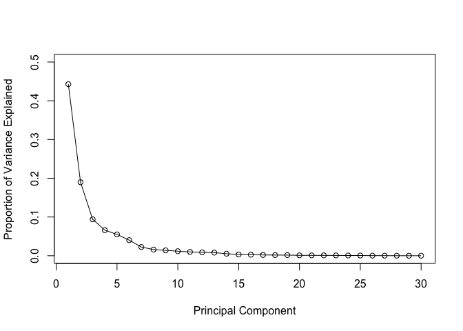
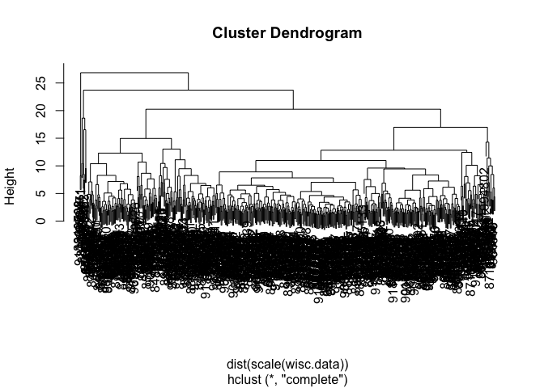
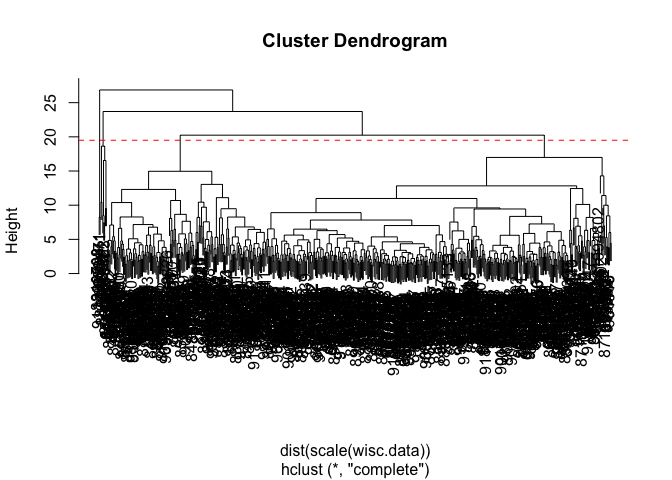

Class 8: Machine Learning Mini Project
================
Cynthia Lin

In today’s mini project we will explore a complete analysis using the
unsupervised learning techniques covered in class (clustering and PCA
for now).

The data itself comes from the Wisconsin Breast Cancer Diagnostic Data
Set FNA breast biopsy data.

\##Data Import

``` r
wisc.df <- read.csv("WisconsinCancer.csv", row.names=1)
head(wisc.df)
```

             diagnosis radius_mean texture_mean perimeter_mean area_mean
    842302           M       17.99        10.38         122.80    1001.0
    842517           M       20.57        17.77         132.90    1326.0
    84300903         M       19.69        21.25         130.00    1203.0
    84348301         M       11.42        20.38          77.58     386.1
    84358402         M       20.29        14.34         135.10    1297.0
    843786           M       12.45        15.70          82.57     477.1
             smoothness_mean compactness_mean concavity_mean concave.points_mean
    842302           0.11840          0.27760         0.3001             0.14710
    842517           0.08474          0.07864         0.0869             0.07017
    84300903         0.10960          0.15990         0.1974             0.12790
    84348301         0.14250          0.28390         0.2414             0.10520
    84358402         0.10030          0.13280         0.1980             0.10430
    843786           0.12780          0.17000         0.1578             0.08089
             symmetry_mean fractal_dimension_mean radius_se texture_se perimeter_se
    842302          0.2419                0.07871    1.0950     0.9053        8.589
    842517          0.1812                0.05667    0.5435     0.7339        3.398
    84300903        0.2069                0.05999    0.7456     0.7869        4.585
    84348301        0.2597                0.09744    0.4956     1.1560        3.445
    84358402        0.1809                0.05883    0.7572     0.7813        5.438
    843786          0.2087                0.07613    0.3345     0.8902        2.217
             area_se smoothness_se compactness_se concavity_se concave.points_se
    842302    153.40      0.006399        0.04904      0.05373           0.01587
    842517     74.08      0.005225        0.01308      0.01860           0.01340
    84300903   94.03      0.006150        0.04006      0.03832           0.02058
    84348301   27.23      0.009110        0.07458      0.05661           0.01867
    84358402   94.44      0.011490        0.02461      0.05688           0.01885
    843786     27.19      0.007510        0.03345      0.03672           0.01137
             symmetry_se fractal_dimension_se radius_worst texture_worst
    842302       0.03003             0.006193        25.38         17.33
    842517       0.01389             0.003532        24.99         23.41
    84300903     0.02250             0.004571        23.57         25.53
    84348301     0.05963             0.009208        14.91         26.50
    84358402     0.01756             0.005115        22.54         16.67
    843786       0.02165             0.005082        15.47         23.75
             perimeter_worst area_worst smoothness_worst compactness_worst
    842302            184.60     2019.0           0.1622            0.6656
    842517            158.80     1956.0           0.1238            0.1866
    84300903          152.50     1709.0           0.1444            0.4245
    84348301           98.87      567.7           0.2098            0.8663
    84358402          152.20     1575.0           0.1374            0.2050
    843786            103.40      741.6           0.1791            0.5249
             concavity_worst concave.points_worst symmetry_worst
    842302            0.7119               0.2654         0.4601
    842517            0.2416               0.1860         0.2750
    84300903          0.4504               0.2430         0.3613
    84348301          0.6869               0.2575         0.6638
    84358402          0.4000               0.1625         0.2364
    843786            0.5355               0.1741         0.3985
             fractal_dimension_worst
    842302                   0.11890
    842517                   0.08902
    84300903                 0.08758
    84348301                 0.17300
    84358402                 0.07678
    843786                   0.12440

# Save your input data file into your Project directory

``` r
fna.data <- "WisconsinCancer.csv"
head(wisc.df)
```

             diagnosis radius_mean texture_mean perimeter_mean area_mean
    842302           M       17.99        10.38         122.80    1001.0
    842517           M       20.57        17.77         132.90    1326.0
    84300903         M       19.69        21.25         130.00    1203.0
    84348301         M       11.42        20.38          77.58     386.1
    84358402         M       20.29        14.34         135.10    1297.0
    843786           M       12.45        15.70          82.57     477.1
             smoothness_mean compactness_mean concavity_mean concave.points_mean
    842302           0.11840          0.27760         0.3001             0.14710
    842517           0.08474          0.07864         0.0869             0.07017
    84300903         0.10960          0.15990         0.1974             0.12790
    84348301         0.14250          0.28390         0.2414             0.10520
    84358402         0.10030          0.13280         0.1980             0.10430
    843786           0.12780          0.17000         0.1578             0.08089
             symmetry_mean fractal_dimension_mean radius_se texture_se perimeter_se
    842302          0.2419                0.07871    1.0950     0.9053        8.589
    842517          0.1812                0.05667    0.5435     0.7339        3.398
    84300903        0.2069                0.05999    0.7456     0.7869        4.585
    84348301        0.2597                0.09744    0.4956     1.1560        3.445
    84358402        0.1809                0.05883    0.7572     0.7813        5.438
    843786          0.2087                0.07613    0.3345     0.8902        2.217
             area_se smoothness_se compactness_se concavity_se concave.points_se
    842302    153.40      0.006399        0.04904      0.05373           0.01587
    842517     74.08      0.005225        0.01308      0.01860           0.01340
    84300903   94.03      0.006150        0.04006      0.03832           0.02058
    84348301   27.23      0.009110        0.07458      0.05661           0.01867
    84358402   94.44      0.011490        0.02461      0.05688           0.01885
    843786     27.19      0.007510        0.03345      0.03672           0.01137
             symmetry_se fractal_dimension_se radius_worst texture_worst
    842302       0.03003             0.006193        25.38         17.33
    842517       0.01389             0.003532        24.99         23.41
    84300903     0.02250             0.004571        23.57         25.53
    84348301     0.05963             0.009208        14.91         26.50
    84358402     0.01756             0.005115        22.54         16.67
    843786       0.02165             0.005082        15.47         23.75
             perimeter_worst area_worst smoothness_worst compactness_worst
    842302            184.60     2019.0           0.1622            0.6656
    842517            158.80     1956.0           0.1238            0.1866
    84300903          152.50     1709.0           0.1444            0.4245
    84348301           98.87      567.7           0.2098            0.8663
    84358402          152.20     1575.0           0.1374            0.2050
    843786            103.40      741.6           0.1791            0.5249
             concavity_worst concave.points_worst symmetry_worst
    842302            0.7119               0.2654         0.4601
    842517            0.2416               0.1860         0.2750
    84300903          0.4504               0.2430         0.3613
    84348301          0.6869               0.2575         0.6638
    84358402          0.4000               0.1625         0.2364
    843786            0.5355               0.1741         0.3985
             fractal_dimension_worst
    842302                   0.11890
    842517                   0.08902
    84300903                 0.08758
    84348301                 0.17300
    84358402                 0.07678
    843786                   0.12440

Remove the diagnosis column and keep it in a separate vector for later.

``` r
diagnosis <-  as.factor(wisc.df[,1])
wisc.data <- wisc.df[,-1]
head(wisc.data)
```

             radius_mean texture_mean perimeter_mean area_mean smoothness_mean
    842302         17.99        10.38         122.80    1001.0         0.11840
    842517         20.57        17.77         132.90    1326.0         0.08474
    84300903       19.69        21.25         130.00    1203.0         0.10960
    84348301       11.42        20.38          77.58     386.1         0.14250
    84358402       20.29        14.34         135.10    1297.0         0.10030
    843786         12.45        15.70          82.57     477.1         0.12780
             compactness_mean concavity_mean concave.points_mean symmetry_mean
    842302            0.27760         0.3001             0.14710        0.2419
    842517            0.07864         0.0869             0.07017        0.1812
    84300903          0.15990         0.1974             0.12790        0.2069
    84348301          0.28390         0.2414             0.10520        0.2597
    84358402          0.13280         0.1980             0.10430        0.1809
    843786            0.17000         0.1578             0.08089        0.2087
             fractal_dimension_mean radius_se texture_se perimeter_se area_se
    842302                  0.07871    1.0950     0.9053        8.589  153.40
    842517                  0.05667    0.5435     0.7339        3.398   74.08
    84300903                0.05999    0.7456     0.7869        4.585   94.03
    84348301                0.09744    0.4956     1.1560        3.445   27.23
    84358402                0.05883    0.7572     0.7813        5.438   94.44
    843786                  0.07613    0.3345     0.8902        2.217   27.19
             smoothness_se compactness_se concavity_se concave.points_se
    842302        0.006399        0.04904      0.05373           0.01587
    842517        0.005225        0.01308      0.01860           0.01340
    84300903      0.006150        0.04006      0.03832           0.02058
    84348301      0.009110        0.07458      0.05661           0.01867
    84358402      0.011490        0.02461      0.05688           0.01885
    843786        0.007510        0.03345      0.03672           0.01137
             symmetry_se fractal_dimension_se radius_worst texture_worst
    842302       0.03003             0.006193        25.38         17.33
    842517       0.01389             0.003532        24.99         23.41
    84300903     0.02250             0.004571        23.57         25.53
    84348301     0.05963             0.009208        14.91         26.50
    84358402     0.01756             0.005115        22.54         16.67
    843786       0.02165             0.005082        15.47         23.75
             perimeter_worst area_worst smoothness_worst compactness_worst
    842302            184.60     2019.0           0.1622            0.6656
    842517            158.80     1956.0           0.1238            0.1866
    84300903          152.50     1709.0           0.1444            0.4245
    84348301           98.87      567.7           0.2098            0.8663
    84358402          152.20     1575.0           0.1374            0.2050
    843786            103.40      741.6           0.1791            0.5249
             concavity_worst concave.points_worst symmetry_worst
    842302            0.7119               0.2654         0.4601
    842517            0.2416               0.1860         0.2750
    84300903          0.4504               0.2430         0.3613
    84348301          0.6869               0.2575         0.6638
    84358402          0.4000               0.1625         0.2364
    843786            0.5355               0.1741         0.3985
             fractal_dimension_worst
    842302                   0.11890
    842517                   0.08902
    84300903                 0.08758
    84348301                 0.17300
    84358402                 0.07678
    843786                   0.12440

\##Exploratory data analysis The first step of any data analysis,
unsupervised or supervised, is to familiarize yourself with the data.

> Q1. How many obsrevations are in this dataset?

``` r
nrow(wisc.data)
```

    [1] 569

> Q2. How many of the obserations have a malignant diagnosis?

``` r
table(wisc.df$diagnosis)
```


      B   M 
    357 212 

> Q3. How many vairables/features in the data are suffixed with \_mean?

first find the column names

``` r
colnames(wisc.data)
```

     [1] "radius_mean"             "texture_mean"           
     [3] "perimeter_mean"          "area_mean"              
     [5] "smoothness_mean"         "compactness_mean"       
     [7] "concavity_mean"          "concave.points_mean"    
     [9] "symmetry_mean"           "fractal_dimension_mean" 
    [11] "radius_se"               "texture_se"             
    [13] "perimeter_se"            "area_se"                
    [15] "smoothness_se"           "compactness_se"         
    [17] "concavity_se"            "concave.points_se"      
    [19] "symmetry_se"             "fractal_dimension_se"   
    [21] "radius_worst"            "texture_worst"          
    [23] "perimeter_worst"         "area_worst"             
    [25] "smoothness_worst"        "compactness_worst"      
    [27] "concavity_worst"         "concave.points_worst"   
    [29] "symmetry_worst"          "fractal_dimension_worst"

Next I need to search within the column names for “\_mean” pattern. The
`grep()` function might help here.

``` r
inds <- grep("_mean", colnames(wisc.data))
length(inds)
```

    [1] 10

> Q. How many dimesnions are in this dataset?

``` r
ncol(wisc.data)
```

    [1] 30

# Principal Component Analysis

First do we need to scale the data before PCA or not.

``` r
apply(wisc.data, 2, sd)
```

                radius_mean            texture_mean          perimeter_mean 
               3.524049e+00            4.301036e+00            2.429898e+01 
                  area_mean         smoothness_mean        compactness_mean 
               3.519141e+02            1.406413e-02            5.281276e-02 
             concavity_mean     concave.points_mean           symmetry_mean 
               7.971981e-02            3.880284e-02            2.741428e-02 
     fractal_dimension_mean               radius_se              texture_se 
               7.060363e-03            2.773127e-01            5.516484e-01 
               perimeter_se                 area_se           smoothness_se 
               2.021855e+00            4.549101e+01            3.002518e-03 
             compactness_se            concavity_se       concave.points_se 
               1.790818e-02            3.018606e-02            6.170285e-03 
                symmetry_se    fractal_dimension_se            radius_worst 
               8.266372e-03            2.646071e-03            4.833242e+00 
              texture_worst         perimeter_worst              area_worst 
               6.146258e+00            3.360254e+01            5.693570e+02 
           smoothness_worst       compactness_worst         concavity_worst 
               2.283243e-02            1.573365e-01            2.086243e-01 
       concave.points_worst          symmetry_worst fractal_dimension_worst 
               6.573234e-02            6.186747e-02            1.806127e-02 

LOOKS LIKE WE NEED TO SCALE.

``` r
#Perform PCA on wisc.data by completing the following code
wisc.pr <- prcomp(wisc.data, scale = TRUE)
summary(wisc.pr)
```

    Importance of components:
                              PC1    PC2     PC3     PC4     PC5     PC6     PC7
    Standard deviation     3.6444 2.3857 1.67867 1.40735 1.28403 1.09880 0.82172
    Proportion of Variance 0.4427 0.1897 0.09393 0.06602 0.05496 0.04025 0.02251
    Cumulative Proportion  0.4427 0.6324 0.72636 0.79239 0.84734 0.88759 0.91010
                               PC8    PC9    PC10   PC11    PC12    PC13    PC14
    Standard deviation     0.69037 0.6457 0.59219 0.5421 0.51104 0.49128 0.39624
    Proportion of Variance 0.01589 0.0139 0.01169 0.0098 0.00871 0.00805 0.00523
    Cumulative Proportion  0.92598 0.9399 0.95157 0.9614 0.97007 0.97812 0.98335
                              PC15    PC16    PC17    PC18    PC19    PC20   PC21
    Standard deviation     0.30681 0.28260 0.24372 0.22939 0.22244 0.17652 0.1731
    Proportion of Variance 0.00314 0.00266 0.00198 0.00175 0.00165 0.00104 0.0010
    Cumulative Proportion  0.98649 0.98915 0.99113 0.99288 0.99453 0.99557 0.9966
                              PC22    PC23   PC24    PC25    PC26    PC27    PC28
    Standard deviation     0.16565 0.15602 0.1344 0.12442 0.09043 0.08307 0.03987
    Proportion of Variance 0.00091 0.00081 0.0006 0.00052 0.00027 0.00023 0.00005
    Cumulative Proportion  0.99749 0.99830 0.9989 0.99942 0.99969 0.99992 0.99997
                              PC29    PC30
    Standard deviation     0.02736 0.01153
    Proportion of Variance 0.00002 0.00000
    Cumulative Proportion  1.00000 1.00000

> Q4. From your results, what proportion of the original variance is
> captured by the first principal components (PC1)?

44.27%

> Q5. How many principal components (PCs) are required to describe at
> least 70% of the original variance in the data?

3 PCs capture 72%

> Q6. How many principal components (PCs) are required to describe at
> least 90% of the original variance in the data?

7 principal components are required to describe at least 90% of the
original variance in the data.

## PC plot

we need to make our plot PC1 vs PC2 (aka score plo, PC-plot, etc.). The
main result of PCA…

``` r
plot(wisc.pr$x[,1], wisc.pr$x[,2], col=diagnosis)
```


``` r
biplot(wisc.pr)
```


> Q7. What stands out to you about this plot? Is it easy or difficult to
> understand? Why?

The biplot is difficult to understand as everything is crowded together
and overlapping each other. It is impossible to read and decipher what
it says or interpret much from this plot.

> Q8. Generate a similar plot for principal components 1 and 3. What do
> you notice about these plots?

``` r
plot(wisc.pr$x[,1], wisc.pr$x[,3], col = diagnosis, 
     xlab = "PC1", ylab = "PC3")
```


This graph is good because we can see a separation of the malignant and
bengign samples. We can also see the clustering.

# using ggplot

``` r
library(ggplot2)
pc <- as.data.frame(wisc.pr$x)
pc$diagnosis <- diagnosis
ggplot(pc, aes(PC1, PC2, col=diagnosis))  + geom_point()
```


This PCA plot shows a separation of the Malignant from Benign samples.
Malignant is blue and red is Benign. Each point is a sample and those
with similar characteristics should cluster together.

## variance explained

We can get this form the output of the `summary()` function.

``` r
summary(wisc.pr)
```

    Importance of components:
                              PC1    PC2     PC3     PC4     PC5     PC6     PC7
    Standard deviation     3.6444 2.3857 1.67867 1.40735 1.28403 1.09880 0.82172
    Proportion of Variance 0.4427 0.1897 0.09393 0.06602 0.05496 0.04025 0.02251
    Cumulative Proportion  0.4427 0.6324 0.72636 0.79239 0.84734 0.88759 0.91010
                               PC8    PC9    PC10   PC11    PC12    PC13    PC14
    Standard deviation     0.69037 0.6457 0.59219 0.5421 0.51104 0.49128 0.39624
    Proportion of Variance 0.01589 0.0139 0.01169 0.0098 0.00871 0.00805 0.00523
    Cumulative Proportion  0.92598 0.9399 0.95157 0.9614 0.97007 0.97812 0.98335
                              PC15    PC16    PC17    PC18    PC19    PC20   PC21
    Standard deviation     0.30681 0.28260 0.24372 0.22939 0.22244 0.17652 0.1731
    Proportion of Variance 0.00314 0.00266 0.00198 0.00175 0.00165 0.00104 0.0010
    Cumulative Proportion  0.98649 0.98915 0.99113 0.99288 0.99453 0.99557 0.9966
                              PC22    PC23   PC24    PC25    PC26    PC27    PC28
    Standard deviation     0.16565 0.15602 0.1344 0.12442 0.09043 0.08307 0.03987
    Proportion of Variance 0.00091 0.00081 0.0006 0.00052 0.00027 0.00023 0.00005
    Cumulative Proportion  0.99749 0.99830 0.9989 0.99942 0.99969 0.99992 0.99997
                              PC29    PC30
    Standard deviation     0.02736 0.01153
    Proportion of Variance 0.00002 0.00000
    Cumulative Proportion  1.00000 1.00000

Calculate the variance of each principal component by squaring the sdev
component of wisc.pr (ie wisc.pr\$sdev^2) save the result as an object
called pr.var.

``` r
#calculate variance of each component
pr.var <- wisc.pr$sdev^2
head(pr.var)
```

    [1] 13.281608  5.691355  2.817949  1.980640  1.648731  1.207357

Calculate the variance explained by each principal component by dividing
by the total variance explained of all principal components.

``` r
# Variance explained by each principal component: pve
pve <- pr.var / sum(pr.var)
# Plot variance explained for each principal component
plot(pve, xlab = "Principal Component", 
     ylab = "Proportion of Variance Explained", 
     ylim = c(0, 0.5), type = "o")
```



``` r
# Alternative scree plot of the same data, note data driven y-axis
barplot(pve, ylab = "Precent of Variance Explained",
     names.arg=paste0("PC",1:length(pve)), las=2, axes = FALSE)
axis(2, at=pve, labels=round(pve,2)*100 )
```


\#Examine the PC loadings

How much do the original variables contribute to the new PCs that we
have calculated? To get at this data we can look at the `$rotation`
component of the returned PCA object.

``` r
head(wisc.pr$rotation[,1:3])
```

                            PC1         PC2          PC3
    radius_mean      -0.2189024  0.23385713 -0.008531243
    texture_mean     -0.1037246  0.05970609  0.064549903
    perimeter_mean   -0.2275373  0.21518136 -0.009314220
    area_mean        -0.2209950  0.23107671  0.028699526
    smoothness_mean  -0.1425897 -0.18611302 -0.104291904
    compactness_mean -0.2392854 -0.15189161 -0.074091571

Focus on PC1 \>Q9. For the first principal component, what is the
component of the loading vector (i.e. wisc.pr\$rotation\[,1\]) for the
feature concave.points_mean?

The component of the loading vector for the feature concav.points_mean
is

``` r
wisc.pr$rotation["concave.points_mean",1]
```

    [1] -0.2608538

There is a complicated mix of variables that go together to make up PC1
= i.e. there are many of the original variables that together contribute
highly to PC1.

``` r
loadings <- as.data.frame(wisc.pr$rotation)
ggplot(loadings) + aes(PC1, rownames(loadings)) + geom_col()
```


> Q10. What is the minimum number of principal components required to
> explain 80% of the variance of the data?

The minimum number of principal components required to explain 80% of
the variance of the data is 3 principal components.

## Hierarchal Clustering

The goal of this section is to do hierarchal clusterng or the original
data.

First we will scale the data, then distance matrix, then hclust

``` r
wisc.hclust <- hclust( dist( scale (wisc.data)))
```

``` r
plot(wisc.hclust)
```



> Q11. Using the plot() and abline() functions, what is the height at
> which the clustering model has 4 clusters?

``` r
plot(wisc.hclust) + abline(h=19.5, col="red", lty=2)
```



    integer(0)

> Q12. Can you find a better cluster vs diagnoses match by cutting into
> a different number of clusters between 2 and 10?

Cut this tree to yield cluster membership vector with `cutree()`
function.

``` r
grps <- cutree(wisc.hclust, h=19)
table(grps)
```

    grps
      1   2   3   4 
    177   7 383   2 

``` r
table(grps, diagnosis)
```

        diagnosis
    grps   B   M
       1  12 165
       2   2   5
       3 343  40
       4   0   2

> Q13. Which method gives your favorite results for the same data.dist
> dataset? Explain your reasoning.

I like the method where we used `ward.D2` gives my favorite results for
the same data.dist dataset because it minimizes the amount of variance
within the clusters. It also looks more separated and organized in my
opinion.

\#Combine methods: PCA and HCLUST

My PCA results were interesting as they showed a separation of M and B
samples along PC1.

``` r
plot(wisc.pr$x[,1], wisc.pr$x[,2], col=diagnosis)
```


I want to cluster my PCA results - that is use `wisc.pr$x` as input to
`hclust()` ’

Try clustering in 3 PCs, that is PC1, PC2, PC3 as input

``` r
d <- dist(wisc.pr$x[,1:3])
wisc.pr.hclust <- hclust(d, method="ward.D2")
```

My resulting figure

``` r
plot(wisc.pr.hclust)
```


Lets cut this tree into 2 groups/clsuters

``` r
grps <- cutree(wisc.pr.hclust, k=2)
table(grps)
```

    grps
      1   2 
    203 366 

``` r
plot(wisc.pr$x[,1], wisc.pr$x[,2], col=grps)
```


How well do the two clusters separate the M and B diagsosis

``` r
table(grps, diagnosis)
```

        diagnosis
    grps   B   M
       1  24 179
       2 333  33

``` r
(179 + 333) / nrow(wisc.data)
```

    [1] 0.8998243

> Q15. How well does the newly created model with four clusters separate
> out the two diagnoses?

``` r
d <- dist(wisc.pr$x[,1:7])
wisc.pr.hclust <- hclust(d, method="ward.D2")
wisc.pr.hclust.clusters <- cutree(wisc.pr.hclust, k=2)
```

``` r
# Compare to actual diagnoses
table(wisc.pr.hclust.clusters, diagnosis)
```

                           diagnosis
    wisc.pr.hclust.clusters   B   M
                          1  28 188
                          2 329  24

I think that the newly created model with four clusters separates out
the two diagnoses well because it is more concise and clear. I am more
able to see the clustering and separation of the malignant and benign
groups compared to earlier models.
